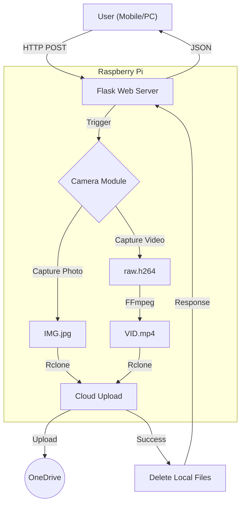

# SmartSight
AI Navigation Smart Glasses for the Visually Impaired using Raspberry PI 4B

# 📸 RPi Cloud Cam Uploader
A lightweight Flask web interface for the Raspberry Pi that captures photos or videos and automatically uploads them to Microsoft OneDrive (or any cloud storage) using **Rclone**.


## 🚀 Features

* **Web Interface:** Simple control via any browser on the local network.
* **Instant Photo Mode:** Captures high-res images using `rpicam-still`.
* **Video Mode:** Records 5-second clips, automatically converts them to MP4 (Android/iOS compatible), and uploads them.
* **Auto-Cleanup:** Deletes local files immediately after a successful upload to save SD card space.
* **Cloud Sync:** Uses `rclone` for reliable, secure uploads to OneDrive.

---

## 🛠️ System Architecture

Here is how the data flows from your browser to the cloud:



---

## 📋 Prerequisites

Before running the Python code, you must install the necessary system tools on your Raspberry Pi.

### 1. Install System Dependencies

Open your terminal and run:

```bash
sudo apt update
sudo apt install ffmpeg rclone

```

### 2. Configure Rclone

You need to connect Rclone to your OneDrive account.

1. Run the config wizard:
```bash
rclone config

```


2. Create a new remote named **`cloud_sight`** (matches the code configuration).
3. Select `onedrive` from the list.
4. Follow the on-screen instructions to authorize via your browser.

### 3. Verify Camera

Ensure your Raspberry Pi camera is enabled and working with the modern libcamera stack:

```bash
rpicam-hello

```

---

## ⚙️ Installation & Setup

1. **Clone or Download this repository** to your Raspberry Pi.
2. **Install Python Requirements:**
```bash
pip install -r requirements.txt

```


*Note: If you see a `numpy` error, run: `pip install "numpy<2.0"`*

3. **Project Structure:**
Ensure your folder looks like this:
```
/project-folder
├── app.py                # The main Flask application
├── requirements.txt      # Python dependencies
└── templates/
    └── index.html        # Your HTML frontend

```


---

## ▶️ Usage

1. **Start the Server:**
```bash
python app.py

```


*You should see output indicating the server is running on port 5000.*
2. **Access the Interface:**
* Find your Pi's IP address: `hostname -I`
* Open a browser on your phone/laptop and go to: `http://<YOUR_PI_IP>:5000`


3. **Capture:**
* Click **Capture Photo** or **Record Video**.
* Watch the terminal for status updates (`[*] Uploading...`).
* Check your OneDrive folder (`Apps/rclone/rpi cam` or similar) to see the files appear!


---

## 🔧 Configuration

If you want to change the cloud destination, edit the top of `app.py`:

```python
# Name of your Rclone remote (set during 'rclone config')
RCLONE_REMOTE = "cloud_sight" 

# Folder path inside your OneDrive
CLOUD_FOLDER = "rpi cam" 

```

## 🐛 Troubleshooting

| Issue | Solution |
| --- | --- |
| **"Camera/Upload Failed"** | Check if another app is using the camera. Run `rpicam-hello` to test. |
| **"Video Failed"** | Ensure `ffmpeg` is installed (`sudo apt install ffmpeg`). |
| **Rclone Error** | Run `rclone listremotes` to check if your remote name matches `cloud_sight`. |
| **Numpy Error** | Run `pip install "numpy<2.0"` to fix version conflicts. |

---

Made with ❤️ and 🐍 Python

```

```
